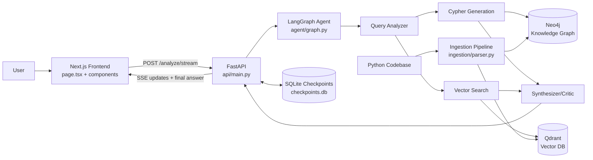
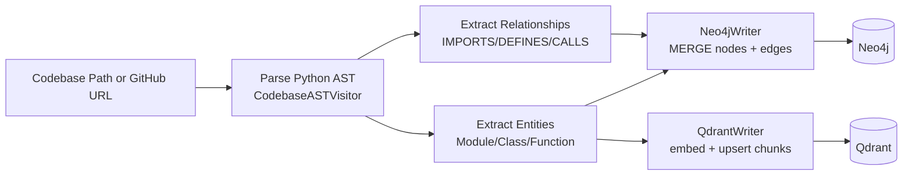
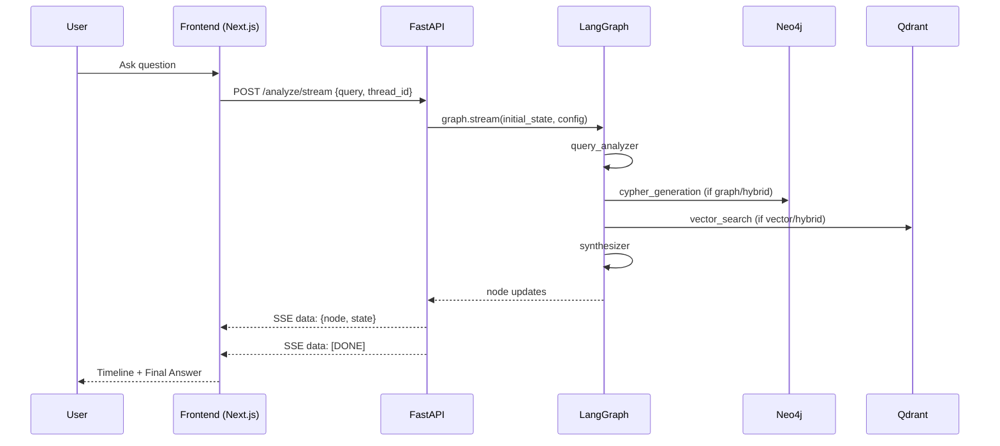

# Agentic GraphRAG: Comprehensive Project Documentation

This document explains how the `Agentic GraphRAG` project works end-to-end for someone with basic LLM knowledge.

The goal is not just "what files exist," but **how the system thinks**, **how data flows**, and **which agentic concepts are implemented in code**.

---

## 1) What This Project Builds

This project is an AI system that answers questions about a Python codebase by combining:

- **Knowledge Graph retrieval** (Neo4j) for structural facts (imports, calls, definitions)
- **Vector retrieval** (Qdrant) for semantic similarity (docstrings/source meaning)
- **LLM reasoning and orchestration** (LangGraph) to plan, route, and synthesize
- **Streaming UI** (Next.js) to show pipeline steps in real time

In simple words: this is a **codebase question-answering agent** that can reason over both graph structure and semantic text.

---

## 2) Core Concepts (Beginner-Friendly)

If you know LLM basics, these are the key ideas used here:

### 2.1 RAG (Retrieval-Augmented Generation)

Instead of asking an LLM to answer from memory, you first retrieve relevant context from your own data, then ask the LLM to answer using that context.

This project does exactly that, using two retrievers:

- Graph retriever (Neo4j + Cypher)
- Vector retriever (Qdrant + embeddings)

### 2.2 GraphRAG

GraphRAG means retrieval from a knowledge graph. It helps with questions like:

- "What calls this function?"
- "Which module defines this class?"
- "Show relationships between components."

### 2.3 Vector RAG

Vector RAG means semantic retrieval using embeddings. It helps with questions like:

- "Where is authentication logic implemented?"
- "Find code related to retries or caching."

### 2.4 Hybrid Retrieval

Some questions need both structure and meaning. This project supports a **hybrid mode**:

- Retrieve graph structure first
- Then retrieve semantic chunks
- Synthesize final answer from both

### 2.5 Agentic Orchestration

"Agentic" here means the system is not one prompt call. It is a **state machine** with multiple nodes:

- analyze query
- choose retrieval strategy
- perform retrieval(s)
- synthesize answer
- retry retrieval if answer quality is poor

This is implemented with **LangGraph conditional routing**.

### 2.6 Stateful Threads and Memory

Each conversation can have a `thread_id`. State checkpoints are stored in SQLite (`checkpoints.db`) via LangGraph checkpointer.

Result: follow-up questions can continue prior context.

---

## 3) High-Level Architecture

The system has four major layers:

1. **Ingestion Layer**: parse codebase -> build graph + vectors  
   (`ingestion/parser.py`)
2. **Agent Layer**: route and reason over retrieval strategies  
   (`agent/graph.py`, `agent/llm.py`)
3. **API Layer**: serve sync + streaming endpoints  
   (`api/main.py`)
4. **Frontend Layer**: query UI, streaming timeline, graph visualization  
   (`frontend/app/...`)

Supporting modules:

- Settings/config: `config.py`, `.env.example`
- Vector client factory: `qdrant_util.py`
- GitHub ingest support: `ingestion/github.py`
- Infra/deploy: `docker-compose.yml`, `Dockerfile`, `.github/workflows/cloud-run-deploy.yml`

### Architecture Diagram: Full System



---

## 4) End-to-End Lifecycle (What Happens on a Real Query)

### Stage A: Data ingestion (one-time per codebase)

1. User ingests codebase (local path or GitHub URL)
2. Parser walks Python files with AST
3. Entities/relationships written into Neo4j
4. Docstring/source chunks embedded and written to Qdrant

### Diagram: Ingestion Pipeline



### Stage B: User asks a question

1. Frontend sends request to `/analyze/stream` (or `/analyze`)
2. API builds fresh turn state and attaches `thread_id`
3. LangGraph runs:
   - `query_analyzer` chooses `graph` / `vector` / `hybrid`
   - retrieval nodes execute based on strategy
   - `synthesizer` produces final answer with citations
4. If synthesizer returns `[INSUFFICIENT_DATA]`, router retries retrieval (bounded)
5. API streams node updates to frontend as SSE
6. Frontend renders:
   - "Thinking" timeline
   - strategy badges
   - final markdown answer

### Diagram: Request/Response + Streaming



---

## 5) Ingestion Pipeline Deep Dive

File: `ingestion/parser.py`

### 5.1 AST Extraction (`CodebaseASTVisitor`)

For every `.py` file:

- Creates a `module` entity
- Extracts `class` and `function` entities
- Captures:
  - qualified name
  - file path
  - start/end lines
  - docstring
  - source snippet
- Extracts relationships:
  - `IMPORTS`
  - `DEFINES`
  - `CALLS`

This transforms source code into a **structured code graph representation**.

### 5.2 Neo4j Writes (`Neo4jWriter`)

What gets stored:

- Nodes: `Module`, `Class`, `Function` (with shared properties)
- Relationships: `IMPORTS`, `DEFINES`, `CALLS`

Important design choices:

- Uses `MERGE` (idempotent, safe re-ingestion)
- Ensures uniqueness constraints on `qualified_name`
- Keeps unresolved external targets as generic nodes (so call/import edges are preserved)

### 5.3 Qdrant Writes (`QdrantWriter`)

For each entity:

- Up to 2 vector points:
  - docstring chunk
  - source chunk

Metadata payload includes:

- qualified name
- entity type
- file path
- line range
- chunk text

Important design choices:

- deterministic IDs based on hashed keys (idempotent upsert behavior)
- batched embedding calls
- configurable vector dimension and collection name

### 5.4 Ingestion Orchestration

`run_ingestion()` runs Parse -> Neo4j -> Qdrant and returns summary counts.

---

## 6) Agent Layer Deep Dive (LangGraph)

File: `agent/graph.py`

### 6.1 State Schema (`GraphRAGState`)

State fields:

- `messages`: conversation messages
- `query_plan`: strategy and retrieval hints
- `retrieved_graph_data`: Neo4j results
- `retrieved_vector_data`: Qdrant results
- `final_answer`: synthesized response
- `retrieval_attempts`: retry counter

This state is passed through every node and incrementally updated.

### 6.2 Node 1: Query Analyzer

Purpose:

- classify query as `graph`, `vector`, or `hybrid`
- return structured plan JSON:
  - strategy
  - graph query hint
  - semantic query

Why it matters:

- This is the **planning/supervisor step**.
- Retrieval is dynamic, not hardcoded.

### 6.3 Node 2: Cypher Generation + Execution

Purpose:

- generate Cypher from graph hint using LLM
- execute Cypher in Neo4j
- serialize records for downstream synthesis

Why it matters:

- Converts natural-language structural intent into graph database retrieval.

### 6.4 Node 3: Vector Search

Purpose:

- embed semantic query
- run similarity search in Qdrant
- collect top chunks + scores

Why it matters:

- Handles fuzzy concept matching and textual relevance.

### 6.5 Node 4: Synthesizer/Critic

Purpose:

- combine graph and vector evidence
- produce final markdown answer with concrete references

Critic behavior:

- If answer lacks usable references, it can emit `[INSUFFICIENT_DATA]`
- Router then retries retrieval (up to `max_retrieval_retries`)

This is a simple but effective **self-correction loop**.

### 6.6 Conditional Routing (Agentic Core)

Routing functions:

- `route_after_analysis`
- `route_after_cypher`
- `route_after_synthesis`

These implement:

- strategy-dependent path selection
- hybrid chaining
- retry loop termination conditions

This is the core "agentic" behavior in this project.

### Diagram: LangGraph Routing Logic

```mermaid
flowchart TD
    S([START]) --> QA[query_analyzer]
    QA -->|strategy=graph| CG[cypher_generation]
    QA -->|strategy=vector| VS[vector_search]
    QA -->|strategy=hybrid| CG

    CG -->|hybrid| VS
    CG -->|graph| SY[synthesizer]
    VS --> SY

    SY -->|answer starts with [INSUFFICIENT_DATA]<br/>and retries left| RETRY{strategy}
    RETRY -->|graph| CG
    RETRY -->|vector| VS
    RETRY -->|hybrid| CG

    SY -->|good answer or retries exhausted| E([END])
```

### 6.7 Checkpointing

`get_sqlite_checkpointer()` creates SQLite-backed saver used by compiled graph.

Benefits:

- durable multi-turn state
- history retrieval by thread

---

## 7) LLM Abstraction and Fallback

File: `agent/llm.py`

The project supports:

- Google Gemini
- Groq fallback (or primary, based on config)

Flow:

1. Build provider chain from settings
2. Try primary provider
3. On quota/rate errors (429/resource exhausted), switch to fallback if enabled

This improves reliability for free-tier or quota-limited usage.

---

## 8) API Layer Deep Dive

File: `api/main.py`

### 8.1 Startup lifecycle

On app startup:

- initialize checkpointer
- compile LangGraph once
- store graph/checkpointer in `app.state`

This avoids recompiling graph per request.

### 8.2 Main endpoints

- `POST /analyze`: synchronous response with summary fields
- `POST /analyze/stream`: SSE streaming updates per node
- `GET /analyze/stream`: browser-friendly SSE via query params
- `GET /history/{thread_id}`: retrieve checkpoint/thread info
- `POST /ingest`: ingest local path or GitHub repo
- `DELETE /ingest`: clear Neo4j + Qdrant data
- `GET /graph`: graph data for visualization
- `GET /health`: checks Neo4j and Qdrant connectivity

### 8.3 Streaming design

`_stream_graph()` iterates graph updates and sends SSE payloads:

- node name
- human label
- partial state update

Frontend uses this to display live reasoning pipeline.

### 8.4 Error normalization

`_format_api_error()` translates provider quota/auth failures into actionable messages for users.

---

## 9) Frontend Layer Deep Dive

Main files:

- `frontend/app/page.tsx`
- `frontend/app/components/StreamingAnswer.tsx`
- `frontend/app/components/IngestPanel.tsx`
- `frontend/app/components/GraphVisualization.tsx`
- `frontend/app/lib/api.ts`

### 9.1 Main page responsibilities

`page.tsx` handles:

- query input and submit
- thread ID management
- health polling
- SSE stream parsing
- storing pipeline events + final answer

### 9.2 Streaming answer UI

`StreamingAnswer.tsx` shows:

- ordered pipeline events (`query_analyzer`, `cypher_generation`, `vector_search`, `synthesizer`)
- strategy badges (Graph/Vector/Hybrid)
- final answer rendered as markdown

### 9.3 Ingest panel

`IngestPanel.tsx` supports:

- ingest via GitHub URL or local path
- show ingest summary stats
- clear ingested data

### 9.4 Graph visualization

`GraphVisualization.tsx`:

- fetches `/graph`
- draws force-directed graph (`react-force-graph-2d`)
- supports filtering/search/type toggles
- shows node detail panel on click

This gives users structural visibility into what was ingested.

---

## 10) Configuration and Environment

Files:

- `config.py`
- `.env.example`
- `cloudrun.env` (gitignored secret env file for deploy contexts)

Key groups:

- LLM provider settings (Google + Groq fallback)
- embedding model/dimension
- Neo4j connection
- Qdrant local/cloud connection
- ingestion path and clone root
- retry/chunking knobs

`config.py` uses typed settings so all environment variables become explicit and validated.

---

## 11) Infrastructure and Deployment

### 11.1 Local development

`docker-compose.yml` launches:

- Neo4j
- Qdrant

API and frontend are run separately from host environment.

### 11.2 Containerized API

`Dockerfile` builds Python API image and runs Uvicorn on port 8000.

### 11.3 Cloud Run deployment

Workflow: `.github/workflows/cloud-run-deploy.yml`

- deploys backend service on push to `main` for backend-relevant paths
- uses GitHub secrets for GCP auth/project/region
- expects runtime env vars to already be configured in Cloud Run service

---

## 12) Agentic Patterns Implemented in This Project

This project demonstrates several practical agent patterns:

1. **Planner + Tools pattern**
   - query analyzer plans retrieval strategy
   - retrieval nodes act as tools

2. **Conditional execution graph**
   - not every query runs every tool
   - dynamic path chosen at runtime

3. **Hybrid evidence fusion**
   - combines symbolic structure (graph) + dense semantic search (vectors)

4. **Critic-guided retry loop**
   - synthesizer can trigger re-retrieval
   - bounded loop prevents infinite retries

5. **Stateful agent memory**
   - thread-based checkpointing for continuity

6. **Transparent agent UX**
   - pipeline streamed node-by-node so user sees what happened

---

## 13) Example Query Journeys

### 13.1 Structural question
"What classes are defined in module X?"

Likely route:

- analyzer -> `graph`
- cypher_generation -> synthesizer

### 13.2 Semantic question
"Find code related to authentication failures."

Likely route:

- analyzer -> `vector`
- vector_search -> synthesizer

### 13.3 Mixed explanatory question
"Explain how auth works and what calls it."

Likely route:

- analyzer -> `hybrid`
- cypher_generation -> vector_search -> synthesizer

---

## 14) Current Scope and Limitations

1. **Language support**: ingestion currently parses Python (`*.py`) only.
2. **Cypher safety/quality**: LLM-generated Cypher can fail or be suboptimal.
3. **No formal test suite**: dependencies include pytest, but repository has no substantive automated tests yet.
4. **Answer quality bound by retrieval quality**: poor chunking or sparse graph data limits response quality.
5. **Prompt-based critic loop**: useful, but not as robust as formal answer-grounding validators.

---

## 15) Suggested Learning Path for a Newcomer

If you want to learn agentic systems from this project:

1. Start with `README.md` for architecture orientation.
2. Read `ingestion/parser.py` to understand data grounding.
3. Read `agent/graph.py` to understand state-machine orchestration.
4. Read `agent/llm.py` to understand provider reliability/fallback.
5. Read `api/main.py` to understand serving + SSE + memory threads.
6. Run frontend and watch streaming steps for real intuition.
7. Modify one node (e.g., analyzer prompt) and observe behavior changes.

---

## 16) Practical "How to Run" Summary

1. Start infra: `docker-compose up -d`
2. Configure `.env` from `.env.example`
3. Ingest a codebase via API/UI (or `python -m ingestion.parser`)
4. Run API: `python -m api.main`
5. Run frontend in `frontend/`: `npm install && npm run dev`
6. Ask questions and inspect:
   - streamed pipeline in UI
   - Neo4j graph browser
   - Qdrant dashboard

---

## 17) Why This Project Is a Good Agentic Reference

Many demos stop at "LLM + vector DB."  
This project goes further by showing:

- routing decisions
- dual retrieval backends
- structured state transitions
- retries/self-correction
- conversation checkpointing
- streaming observability in UI

That combination makes it a strong practical template for production-minded agentic RAG systems.

