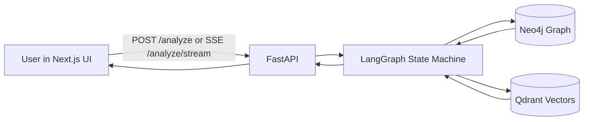
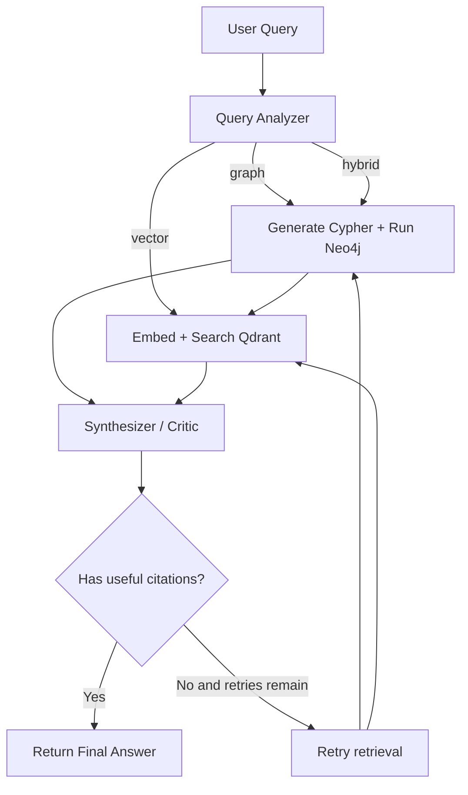
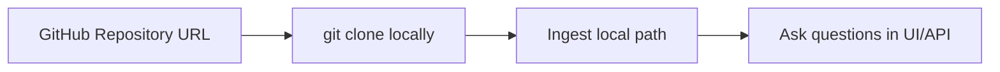
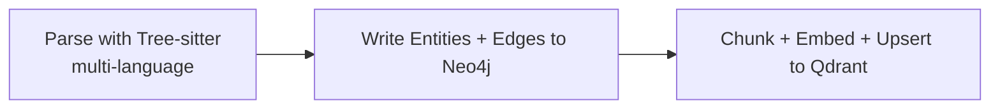

# CodeGraph AI Codebase Analyzer

CodeGraph AI helps you ask natural-language questions about a codebase and get grounded answers using:

- **Tree-sitter** for multi-language parsing (Python, JS/TS, Java, Go, Rust, C/C++, C#, Ruby, PHP, ...)
- **Neo4j** for structural relationships (imports, defines, calls)
- **Qdrant** for semantic similarity search over code/docstrings
- **LangGraph** for multi-step reasoning and routing
- **FastAPI + Next.js** for API + real-time streaming UI

If you want full implementation details, see `AGENTIC_GRAPHRAG_COMPREHENSIVE_DOC.md`.

---

## Why This Project Exists

Traditional code search usually gives either:
- structural truth (who calls what), or
- semantic intent (what this code means),

but rarely both in one answer. This project combines graph + vector retrieval so answers can be both accurate and context-aware.

---

## System At A Glance



### What each layer does

- **Frontend**: Query input, streaming steps, graph visualization
- **API**: Endpoints for query, stream, ingest, graph, health
- **LangGraph**: Chooses graph/vector/hybrid strategy and synthesizes final answer
- **Neo4j**: Stores modules/classes/functions and relationships
- **Qdrant**: Stores embeddings for semantic retrieval

---

## How A Query Is Answered



The agent can self-correct when retrieval is weak, then retry before responding.

---

## Why The Agent Matters

Without an agent, you usually run multiple manual steps: graph query, semantic search, then hand-merge results.
Here, the **LangGraph agent** does that orchestration for you.

### What the agent adds

- **Intent routing**: Decides whether the question needs graph, vector, or hybrid retrieval
- **Tool orchestration**: Runs Neo4j and Qdrant in the right order for the question
- **Evidence synthesis**: Produces one grounded answer instead of disconnected search outputs
- **Self-correction loop**: Retries retrieval when evidence quality is low
- **Stateful conversations**: Maintains continuity across questions with `thread_id`

### Why this is important in practice

- Better answers for architectural questions (dependencies, call flows, ownership)
- Better answers for fuzzy questions (purpose, behavior, intent)
- Fewer hallucinations because responses are tied to retrieved code context
- Faster analysis loops for large repositories

---

## Quick Start (10 Minutes)

### 1) Start infrastructure

```bash
docker-compose up -d
```

Services:
- Neo4j: `bolt://localhost:7687` (`http://localhost:7474`, `neo4j/graphrag2024`)
- Qdrant: `http://localhost:6333` (`/dashboard`)

### 2) Install backend deps

```bash
python -m venv venv
source venv/bin/activate
pip install -r requirements.txt
```

### 3) Configure environment

```bash
cp .env.example .env
# then edit .env (add OPENAI_API_KEY and others if needed)
```

### 4) Ingest a codebase

```bash
python -m ingestion.parser ./sample_codebase
```

### 5) Run backend API

```bash
python -m api.main
```

Backend URLs:
- API: `http://localhost:8000`
- Docs: `http://localhost:8000/docs`

### 6) Run frontend

```bash
cd frontend
npm install
npm run dev
```

Frontend URL:
- `http://localhost:3000`

### 7) Ask a question

```bash
curl -X POST http://localhost:8000/analyze \
  -H "Content-Type: application/json" \
  -d '{"query":"What classes are defined in the auth module and what methods do they have?"}'
```

Streaming mode:

```bash
curl -N "http://localhost:8000/analyze/stream?query=What+classes+are+in+auth%3F"
```

---

## GitHub Workflow (How To Use With Any Repo)

This project analyzes a **local codebase path**.  
For GitHub repositories, the workflow is: **clone locally → ingest path → query**.



### Option A: Analyze a public GitHub repository

```bash
git clone https://github.com/<owner>/<repo>.git
python -m ingestion.parser "./<repo>"
```

Then run backend + frontend and ask questions normally.

### Option B: Analyze a private GitHub repository

```bash
git clone git@github.com:<owner>/<repo>.git
# or use HTTPS if your token/credential helper is configured
python -m ingestion.parser "./<repo>"
```

### Option C: Trigger ingestion via API after cloning

```bash
curl -X POST http://localhost:8000/ingest \
  -H "Content-Type: application/json" \
  -d '{"codebase_path":"./<repo>"}'
```

### Example questions to ask after GitHub ingestion

- "Which modules import `X`, and what can break if I change it?"
- "How does authentication flow from API routes to service classes?"
- "Where is `foo()` called, and what are the downstream side effects?"

---

## Ingestion Pipeline



### Stage details

- **Tree-sitter parser** (`ingestion/treesitter_parser.py`) extracts modules, classes, functions, imports, calls, defines across many languages
- **Neo4j writer** performs idempotent `MERGE` writes
- **Qdrant writer** stores docstring/source chunks with deterministic IDs

---

## Project Layout

```text
.
├── ingestion/          # Parse code and ingest into Neo4j + Qdrant
├── agent/              # LangGraph nodes, routing, synthesis logic
├── api/                # FastAPI endpoints + SSE streaming
├── frontend/           # Next.js app and graph visualization
├── sample_codebase/    # Small demo project to test ingestion
├── config.py           # Centralized settings from env
└── docker-compose.yml  # Local Neo4j + Qdrant
```

---

## Key API Endpoints

- `POST /analyze`: Synchronous answer
- `POST /analyze/stream`: SSE stream (JSON body)
- `GET /analyze/stream`: SSE stream (query params, browser-friendly)
- `POST /ingest`: Trigger ingestion
- `GET /graph`: Fetch graph nodes/links for visualization
- `GET /history/{thread_id}`: Retrieve checkpoint history
- `GET /health`: Health check

---

## Core Configuration

Set these in `.env`:

- `OPENAI_API_KEY`
- `OPENAI_MODEL_NAME` (default: `gpt-4o-mini`)
- `OPENAI_EMBEDDING_MODEL` (default: `text-embedding-3-small`)
- `NEO4J_URI`, `NEO4J_USERNAME`, `NEO4J_PASSWORD`
- `QDRANT_HOST`, `QDRANT_PORT`, `QDRANT_COLLECTION_NAME`
- `TARGET_CODEBASE_PATH`
- `MAX_RETRIEVAL_RETRIES`

---

## LLM Provider Swaps (No Code Changes)

```bash
# OpenAI (default)
OPENAI_API_KEY=sk-...
OPENAI_MODEL_NAME=gpt-4o-mini

# Groq-compatible endpoint
OPENAI_API_BASE=https://api.groq.com/openai/v1
OPENAI_API_KEY=gsk_...
OPENAI_MODEL_NAME=llama3-70b-8192

# Local vLLM/Ollama-compatible endpoint
OPENAI_API_BASE=http://localhost:8080/v1
OPENAI_API_KEY=dummy
OPENAI_MODEL_NAME=meta-llama/Llama-3-8b
```

---

## Troubleshooting

- **No answers / weak answers**: run ingestion again and verify Neo4j + Qdrant are healthy.
- **Frontend does not stream**: ensure backend is running on `:8000` and CORS/network settings are correct.
- **Neo4j auth errors**: verify credentials in `.env` match `docker-compose.yml`.
- **Embedding errors**: confirm `OPENAI_API_KEY` and provider base URL.

---

## What To Read Next

- `AGENTIC_GRAPHRAG_COMPREHENSIVE_DOC.md` for deep architecture and design rationale
- `agent/graph.py` for orchestration logic
- `ingestion/treesitter_parser.py` for multi-language Tree-sitter extraction, and `ingestion/parser.py` for the Neo4j/Qdrant storage flow
